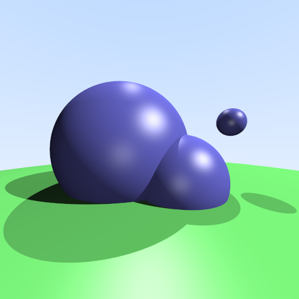
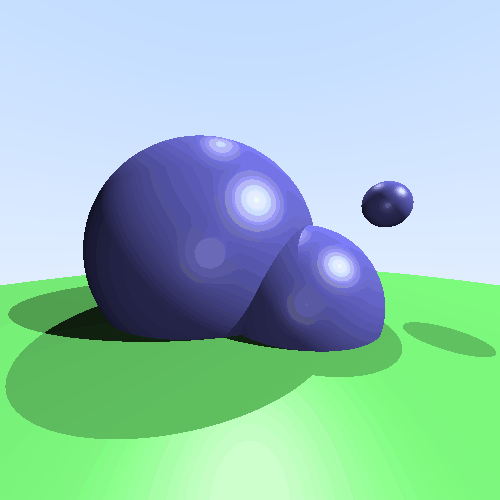
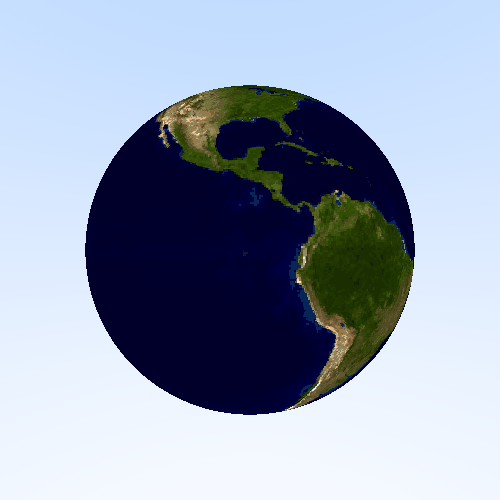
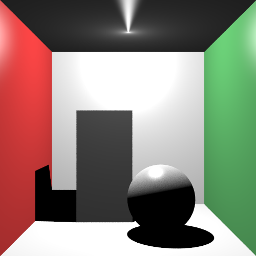
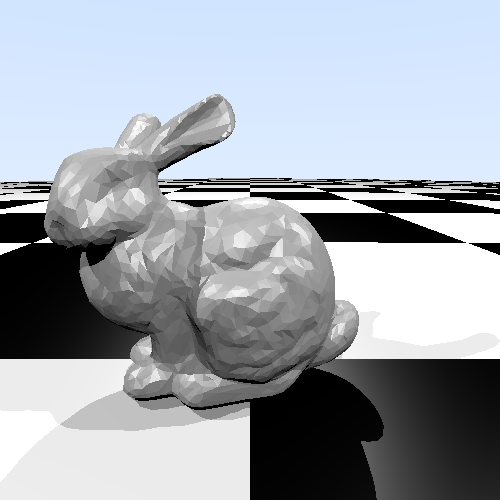
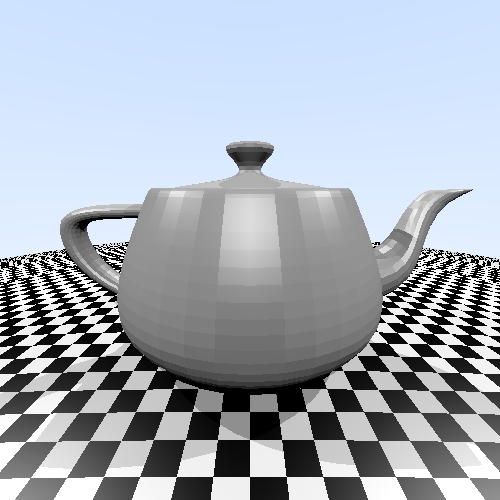
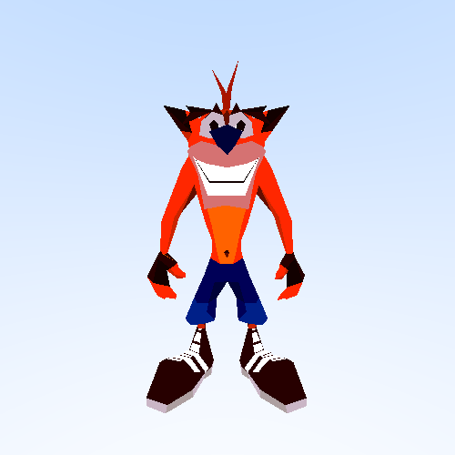
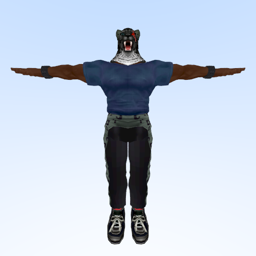

# Project: Ray Tracing

This project was developed as part of the "GPU Computing" course for the Master's degree in Computer Science at the University of Milan (Università degli Studi di Milano). It aims to compare the performance of a naive CPU-based ray tracing algorithm with a highly parallelized version implemented on a GPU using CUDA.

## Features

- **CPU Implementation**: A straightforward, sequential version of the ray tracing algorithm.
- **GPU Implementation**: A highly parallelized version that leverages thousands of GPU threads to accelerate computations.
- **Project Report**: For a detailed explanation of the implementation, results, and analysis, please refer to the [project report](./report/report.pdf).

## Requirements

To run this project, you will need the following:

- **NVIDIA GPU**: A compatible NVIDIA GPU is necessary to run the GPU version of the ray tracing algorithm.
- **NVIDIA CUDA Toolkit**: Ensure you have the NVIDIA CUDA Toolkit installed, which includes the `nvcc` compiler required to compile CUDA code. You can download it from the [official NVIDIA website](https://developer.nvidia.com/cuda-downloads).
- **Make**: A build automation tool like `make` is required to use the provided `Makefile` for building and running the project.

## Installation

1. Clone this repository to your local machine:

   ```bash
   git clone https://github.com/Andreal2000/Project-Ray-Tracing.git
   ```

2. Navigate to the project directory:

   ```bash
   cd Project-Ray-Tracing
   ```

3. Build and execute the project using make

## Usage

The project provides a `Makefile` to simplify the build and execution process. Below are the available commands and their descriptions:

- **Build CPU version**:  
  Compiles the CPU-based implementation of the ray tracing algorithm.  

  ```bash
  make cpu
  ```

- **Build GPU version**:  
  Compiles the CUDA-based implementation of the ray tracing algorithm.  

  ```bash
  make gpu
  ```

- **Run CPU version**:  
  Compiles and runs the CPU-based version.  

  ```bash
  make cpu-run
  ```

- **Run GPU version**:  
  Compiles and runs the CUDA-based version.  

  ```bash
  make gpu-run
  ```

- **Sanitize GPU version**:  
  Compiles and runs the GPU version with CUDA compute sanitizer to detect memory leaks and race conditions.  

  ```bash
  make gpu-sanitize
  ```

- **Clean build artifacts**:  
  Removes the compiled binaries and other generated files.  

  ```bash
  make clean
  ```

## Showcase

### Balls

  
  

### Earth

  
  

### Cornell Box

  

### Stanford Bunny

  

### Spot

  

### Utah Teapot

  

### Eight Ball

  
  

### Crash Bandicoot

  
  

### King

  

### Mario

  

### Obamium

  
  
